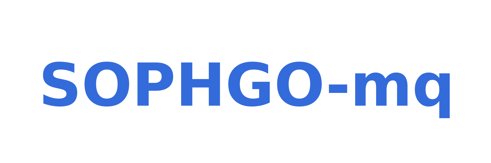

<div align="center">
    
</div>

------------

## Introduction

Sophgo-mq is an open-source model quantization toolkit forked form [MQBench](https://github.com/ModelTC/MQBench). Sophgo-mq has made some customized modifications and added some features based on MQBench.

Sophgo-mq is to provide:

- **Quantitative Scheme**. Fake quantization nodes are inserted into the PyTorch model, and users can customize the insertion points of the nodes as well as the behavior of the fake quantization nodes. After the model training is completed, the corresponding Onnx file as well as calitable and qtable will be exported.
- **Useful Algorithms**. Sophgo-mq supports a variety of quantization algorithms, including quantization algorithms for the CV  and NLP fields.
- **Mixed Precision**. Sophgo-mq supports mixed-precision quantization, which can better ensure the performance of the model after quantization.


## Installation

```shell
git clone https://github.com/sophgo/sophgo-mq.git
cd sophgo-mq
python setup.py install
```

## Quickstart
Let's take the PTQ quantization of ResNet18 as an example.

1. Import packages and define the model.
```python
import torch
import torchvision.models as models
from sophgo_mq.prepare_by_platform import prepare_by_platform
from sophgo_mq.convert_deploy import convert_deploy
from sophgo_mq.utils.state import enable_quantization, enable_calibration

model = models.__dict__['resnet18']()
```

2. Use prepare_by_platform function to insert fake quantization nodes.
```python
extra_prepare_dict = {
    'quant_dict': {
                    'chip': 'SG2260',
                    'quantmode': 'weight_activation',
                    'strategy': 'CNN',
                    },
}
model = prepare_by_platform(model, prepare_custom_config_dict=extra_prepare_dict)
model.eval()
```

3. Define your dataloader and perform forward propagation.
```python
dataloder = ...
enable_calibration(model) ## enable observer to gather calibration information
for input in dataloader:
    output = model(input)
enable_quantization(model) ## enable quantize
```

4. Use convert_deploy function to export Onnx file, calitable and qtable. 
```python
convert_deploy(model, net_type='CNN', 
                input_shape_dict={'input': [1, 3, 224, 224]}, 
                output_path='./', 
                model_name='resnet18')
```


## Usage
### CV PTQ
We support PTQ quantization for common classification models such as ResNet, VGG, and MobileNet ...
```Shell
CUDA_VISIBLE_DEVICES=0 python application/imagenet_example/PTQ/ptq/ptq_main.py \
    --arch=resnet18 \
    --batch-size=64 \
    --cali-batch-num=16 \
    --data_path=/home/data/imagenet \
    --chip=SG2260 \
    --quantmode=weight_activation \
    --seed=1005 \
    --pretrained \
    --quantize_type=naive_ptq \
    --deploy \
    --output_path=./
```

### CV QAT
Sophgo-mq supports QAT quantization for common classification models.
```Shell
CUDA_VISIBLE_DEVICES=0 python application/imagenet_example/main.py \
    --arch=resnet18 \
    --batch-size=128 \
    --lr=1e-4 \
    --epochs=1 \
    --optim=sgd \
    --cuda=0 \
    --pretrained \
    --evaluate \
    --train_data=/home/data/imagenet \
    --val_data=/home/data/imagenet \
    --chip=SG2260 \
    --quantmode=weight_activation \
    --deploy_batch_size=10 \
    --pre_eval_and_export \
    --export_onnx_before_training \
    --output_path=./
```
Sophgo-mq also supports QAT quantization for Yolov5.
```Shell
cd ./application/yolov5_example
export PYTHONPATH=../../:$PYTHONPATH
CUDA_VISIBLE_DEVICES=0 python train.py \
    --cfg=yolov5s.yaml \
    --weights=yolov5s.pt \
    --data=coco.yaml \
    --epochs=5 \
    --output_path=./ \
    --batch-size=8 \
    --quantize \
```

### NLP PTQ
Sophgo-mq supports PTQ quantization for the BERT model on the MRPC dataset.
```Shell
cd ./application/nlp_example
export PYTHONPATH=../../:$PYTHONPATH
python ptq.py --config config.yaml
```

### NLP QAT

Sophgo-mq supports QAT quantization for the BERT model on the SQuAD dataset.

```Shell
cd ./application/nlp_example
export PYTHONPATH=../../:$PYTHONPATH
python qat_bertbase_questionanswer.py
```

## Documentation

todo

## License

This project is released under the [Apache 2.0 license](LICENSE).
