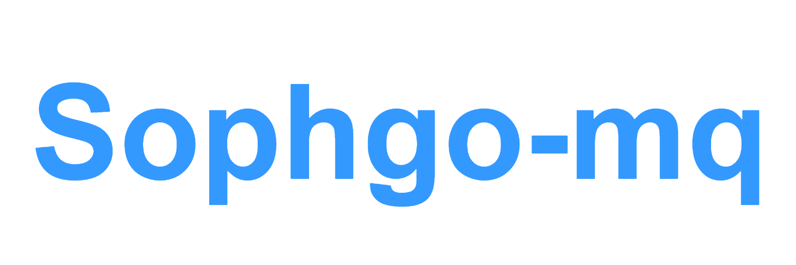

Sophgo-mq Introduction
=========================================

Sophgo-mq is an open-source model quantization toolkit forked form MQBench. Sophgo-mq has made some customized modifications and added some features based on MQBench.

Sophgo-mq is to provide:

- **Quantitative Scheme**. Fake quantization nodes are inserted into the PyTorch model, and users can customize the insertion points of the nodes as well as the behavior of the fake quantization nodes. After the model training is completed, the corresponding Onnx file as well as calitable and qtable will be exported.
- **Useful Algorithms**. Sophgo-mq supports a variety of quantization algorithms, including quantization algorithms for the CV  and NLP fields.
- **Mixed Precision**. Sophgo-mq supports mixed-precision quantization, which can better ensure the performance of the model after quantization.