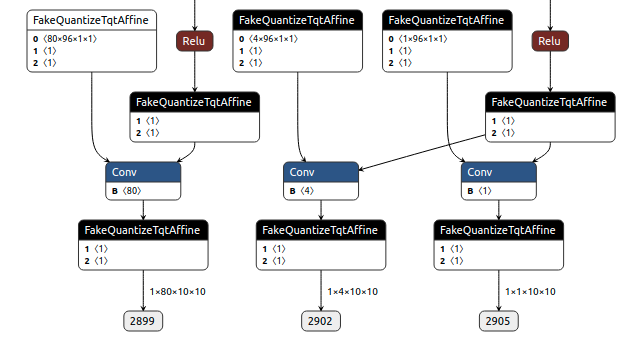
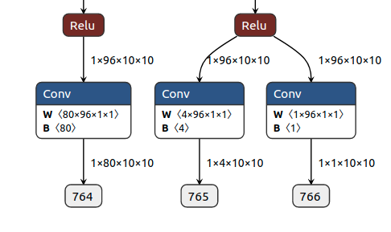
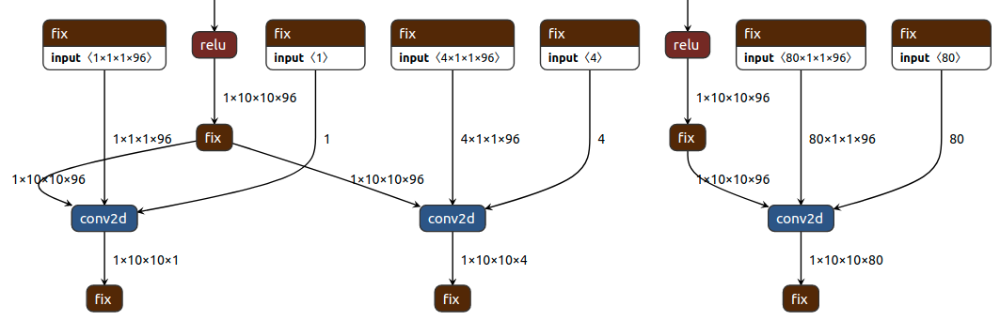

Add a Backend to MQBench: Quick Start 
=======================================

MQBench is able to do quantization over many different backends and quantization algorithms, which relys on the independence of hardware(backends) and software(algorithms). To support a new backend, h/w and s/w should be added.

We provide a typical work-flow:

1. Add ``FakeQuantizeAffine`` to simulate the hardware behavior. Add corresponding ``Observer`` to provide ``FakeQuantizeAffine`` with needed infomation.
2. Add ``ModelQuantizer`` to insert quantize nodes into the model.
3. Add ONNX-Backend translator to deploy the output graph.

In the following sections, we will show how to add a backend gived a specific hardware platform.

FakeQuantize, Observer and Quantization Scheme
----------------------------------------------
.. _add_a_backend_to_mqbench:
   

Quantization Function
^^^^^^^^^^^^^^^^^^^^^

Now we have a fake quantize affine ``ExampleQuant``, where :math:`x, s, z, n, p` are the tensor, scale, zero point, lower bound and upper bound:  

.. math::
    Q(x, s, z, n, p) &= f_1(x, s, z, n, p) \\ 
    \nabla_x Q &= f_2(x, s, z, n, p) \\ 
    \nabla_s Q &= f_3(x, s, z, n, p) \\ 
    \nabla_z Q &= f_4(x, s, z, n, p) \\ 
    \nabla_n Q &= f_5(x, s, z, n, p) \\ 
    \nabla_p Q &= f_6(x, s, z, n, p) \\ 
   
Then we have to deploy the corresponding forward/backward in ``mqbench/fake_quantize/``, like:

.. code-block:: python
    :linenos:

    class ExampleQuant(torch.autograd.Function):
        @staticmethod
        def forward(ctx, x, s, z, n, p):
            q = f_1(x, s, z, n, p)
            ctx.save_for_backward(x, q, s, z, n, p)
            return qx
    
        @staticmethod
        def backward(ctx, grad_outputs):
            x, q, s, z, n, p = ctx.saved_tensors 
            grad_x, grad_s, grad_z, grad_n, grad_p = f_2_to_6(x, q, s, z, n, p)
            return grad_x, grad_s, grad_z, grad_n, grad_p

        @staticmethod
        def symbolic(g, x, scale, zero_point, quant_min, quant_max):
            return g.op("::ExampleQuant", x, scale, zero_point, quant_min_i=quant_min, quant_max_i=quant_max)

Then, wrap it via ``QuantizationBase``. 

.. code-block:: python
    :linenos:

    class ExampleFakeQuantize(QuantizeBase):
        def __init__(self, observer, scale=1., zero_point=0., use_grad_scaling=True, **observer_kwargs):
            super(TqtFakeQuantize, self).__init__(observer, **observer_kwargs)
            self.scale = Parameter(torch.tensor([scale]))
            self.zero_point = Parameter(torch.tensor([zero_point]))

        def forward(self, X):
            # Learnable fake quantize have to zero_point.float() to make it learnable.
            if self.observer_enabled[0] == 1:
                self.activation_post_process(X.detach())
                _scale, _zero_point = self.activation_post_process.calculate_qparams()
                self.scale.data.copy_(_scale)
                self.zero_point.data.copy_(_zero_point.float())
            if self.fake_quant_enabled[0] == 1:
                X = ExampleQuant.apply(X, self.scale, self.zero_point, self.quant_min, self.quant_max)
            return X

Observer 
^^^^^^^^

The quantizable statistics are collected by ``Observer``. It is enabled at calibration stage, and do its job. Given ``g(x)`` is needed to calculate quantization params, we can deploy like: 

.. code-block:: python
    :linenos:

    
    class ExampleObserver(ObserverBase):
        def __init__(self, dtype=torch.quint8, qscheme=torch.per_tensor_affine,
                    reduce_range=False, quant_min=None, quant_max=None, ch_axis=-1, pot_scale=False,
                    factory_kwargs=None):
            super(ExampleObserver, self).__init__(dtype, qscheme, reduce_range, quant_min, quant_max,
                                                ch_axis, pot_scale, factory_kwargs)

        def forward(self, x_orig):
            r"""Records the running minimum and maximum of ``x``."""
            x = x_orig.to(self.min_val.dtype)
            self.collected = g(x) 
            return x
        
        def calculate_qparams(self):
            s, z, n, q = self.collected 
            return s, z, n, q  

Register your FakeQuantize/Observer for your backend
^^^^^^^^^^^^^^^^^^^^^^^^^^^^^^^^^^^^^^^^^^^^^^^^^^^^

Now we have our FakeQuantize and Observer ready, then register it for your platform at ``mqbench.prepare_by_platform``. Import them in just like the FakeQuantizes and Observers already here. Define your backend at the enumeration of BackendType. Then register the quantization scheme, which includes the FakeQuantize and Observer you have just defined and other details like **Per-Channel/Tensor**, **Sym/Asym Quantization** and so on. 

Add Quantization Node into models
---------------------------------

We have the quantization affine and observer and the next step is to insert them as nodes into ``GraphModule``. We have provided lots of APIs for quantizing normal OPs like conv/fc/deconv and so on. If the backend supports what we provided in ``mqbench.custom_quantizer``, just to  re-use the logic used in it.

If there are some constrains for the backend, a normal flow is to extend the ``TensorRT`` backend which quantizes the input of centain ops. 

Quantize a new module(ExampleMod)/function(example_func)

.. code-block:: python
    :linenos:
    :emphasize-lines: 24,35

    @property
    def module_type_to_quant_input(self) -> tuple:
        return (
            ...
            # Example Module 
            ExampleMod
        ) + self.additional_module_typ
        
    
    @property
    def function_type_to_quant_input(self) -> list:
        return [
            ...
            example_func
        ] + self.additional_function_type

Deploy Models for the backend
-----------------------------

The deploy stage will fuse bn into previous modules and remove FakeQuantize nodes from the ``GraphModule``. Just register ``mqbench/convert_deploy.convert_merge_bn`` for your backend.  

We introduced ONNX as a intermediate representation to hold the network infomation, and the quantization related infomation will be dumped into a single json file. First we dump the model with quantization nodes which accquires registeration of ``mqbench/convert_deploy.convert_onnx``. The ONNX graph with quantization nodes is shown as following.

   ONNX Graph with FakeQuantize

Second, remove the fake quantize node and collect needed infomation. For linear/logarithmic quantization, we have ``mqbench.deploy.remove_fakequantize_and_collect_params`` and ``mqbench.deploy.remove_fakequantize_and_collect_params``, which usually needs just simple(or no) changes for other platform.  Let's assume your platform needs (scale, zero_point, quant_min, quant_max, round_mode) to run a model. At ``mqbench.deploy.deploy_linear``'s clip ranges, add your logic to compute all the things from the ONNX graph(with quantization node). The ONNX graph without FakeQuantize is show as following.

   ONNX Graph after Removing FakeQuantizeAffine

With all these steps done, platform-specific translation should be integrated. If your platform's runtime does not support ONNX model input, translate it into preferred form. 

.. code-block:: python
    :linenos:
    
    class LinearQuantizer_process(object):
        ...
        def remove_fakequantize_and_collect_params(self, onnx_path, model_name, backend):
            ...
            if backend == 'example':
                # model is the onnx, context 
                # context is the quantization info'd dict
                example_model = do_translate(model, context)
                logger.info("Finish example model converting process.")

We take Vitis-AI as a example platform here.

   Platform Based Model Representation

