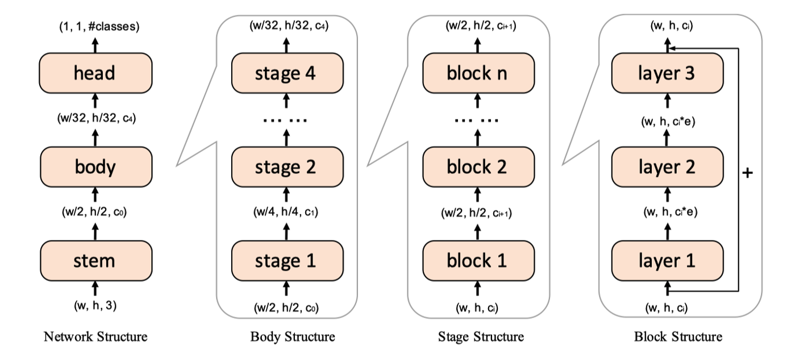

Advanced PTQ
============

In this part, we'll introduce three advanced post-training quantization methods including AdaRound, BRECQ, and QDrop.
Fair experimental comparisons can be found in :doc:`../../benchmark/index`.

Adaround
^^^^^^^^

`AdaRound <https://arxiv.org/pdf/2004.10568.pdf>`_ aims to find the global optimal strategy of rounding the quantized values. In common sense, rounding-to-nearest is optimal for each value, but through theoretical analysis of the quantization loss, it's not the case for the entire network or the whole layer. The second-order term in the difference contains a cross term of the round error, illustrated in a layer of two weights:

.. raw:: latex html

           \[ E[ L(x,y,\mathbf{w}) - L(x,y,\mathbf{w}+\Delta \mathbf{w}) ] \approx \Delta \mathbf{w}^T g^{(\mathbf{w})} + \frac12 \Delta \mathbf{w}^T H^{(\mathbf{w})} \Delta \mathbf{w} \approx \Delta \mathbf{w}_1^2 + \Delta \mathbf{w}_2^2 + \Delta \mathbf{w}_1 \Delta \mathbf{w}_2 \]

Hence, it's beneficial to learn a rounding mask for each layer. One well-designed object function is given by the authors:

.. raw:: latex html

           \[ \mathop{\arg\min}_{\mathbf{V}}\ \ || Wx-\tilde{W}x ||_F^2 + \lambda f_{reg}(\mathbf{V}), \]
           \[ \tilde{W}=s \cdot clip\left( \left\lfloor\dfrac{W}{s}\right\rfloor+h(\mathbf{V}), n, p \right) \]

where :math:`h(\mathbf{V}_{i,j})=clip(\sigma(\mathbf{V}_{i,j})(\zeta-\gamma)+\gamma, 0, 1)`, and :math:`f_{reg}(\mathbf{V})=\mathop{\sum}_{i,j}{1-|2h(\mathbf{V}_{i,j})-1|^\beta}`. By annealing on :math:`\beta`, the rounding mask can adapt freely in initial phase and converge to 0 or 1 in later phase.

BRECQ
^^^^^

Unlike AdaRound learns to reconstruct the output and tune the weight layer by layer, `BRECQ  <https://arxiv.org/pdf/2102.05426.pdf>`_ focus on the following optimization target, which is a more general format:

.. raw:: latex html

           \[ \mathop{min}\limits_{\mathbf{\hat{w}}} E[\frac12 \Delta \mathbf{w}^T H^{(\mathbf{w})} \Delta \mathbf{w}] \]

They find that the large-scale Hessian can be approximated to the final output reconstruction. But ptq usually has only 1k images, so the net-wise output reconstruction might not be a good choice.

.. raw:: latex html

           \[ \mathop{min}\limits_{\mathbf{\hat{w}}} E[\frac12 \Delta \mathbf{w}^T H^{(\mathbf{w})} \Delta \mathbf{w}] \approx \mathop{min}\limits_{\mathbf{\hat{w}}} E[\frac12 \Delta \mathbf{a}^T H^{(\mathbf{a})} \Delta \mathbf{a}] \]

BRECQ discusses 4 different granularity of output reconstruction including layer, block, stage, and net.

Combined with experimental results and theoretical analysis, BRECQ recommends learning weight rounding block by block, where a block is viewed as a collection of layers.

Here, BRECQ obeys the following rules to determine a block:
    1. A layer is a Conv or Linear module, BN and ReLU are attached to that layer.
    2. Residual connection should be in the block, such as BasicBlock in ResNet.
    3. If there is no residual connection, singles layers should be combined unless there are 3 single layers or the next layer meets condition 2.

QDrop
^^^^^

AdaRound and BRECQ finetune the weight by reconstructing output layer-wise or block-wise and achieves SOTA accuracy. However, they determine the activation quantization after the weight reconstruction stage, which will lead to the same optimized model no matter which bit the activation is in use, which is counterintuitive.

According to their experiments, `QDrop <https://arxiv.org/pdf/2203.05740.pdf>`_ draws two observations:
    1. For extremely low-bit quantization, there will be huge accuracy improvement when considering activation quantization during weight tuning.
    2. Partially introducing block-wise activation quantization surpasses introducing the whole activation quantization.

Qdrop investigates how the activation affects weight tuning. they find that by introducing activation quantization during calibration, the trained quantized model is flatter under some perturbation, and the perturbation direction correlates with input data.

However the PTQ is especially sensitive to calibration data. Due to the mismatch between calibration data and test one, introducing the whole activation quantization will highly possible cause overfitting. Inspired by previous experiments, QDrop proposed to further increase the flatness on as many directions as possible. In particular, QDrop randomly disables and enables the quantization of the activation of each forward pass. Finally, QDrop can cover more directions of flatness and thus flatter on test samples.